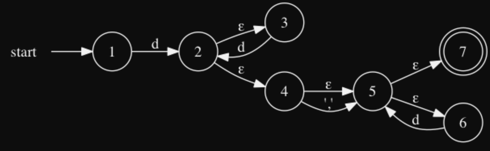

# BSWU BPRD 2018 Jan
## Opgave 1 (20%): Regulære udtryk og automater
### Opgave Beskrivelse:
"_Betragt dette regulære udtryk over alfabetet `{d, ’,’}`, hvor `d` står for decimalt ciffer og `’,’` er komma:_"

`d+ ′ , ′ ? d∗`

"_Ved antagelse af, at `d` svarer til tallene fra `0` til `9` og ’,’ er et komma, så beskriver det regulære udtryk kommatal._"

### Question 1:
#### Spørgsmål:
"_Giv en uformel beskrivelse af sproget (mængden af alle strenge) der beskrives af dette regulære udtryk. Giv mindst 4 eksempler på kommatal der genkendes af dette regulære udtryk og som understøtter din uformelle beskrivelse._"

#### Svar:
Accepts all languages that:
- have at least 1 `d` with any subsequent repeats of `d`.
- this may be followed by a single `','` but it is not necessary.
- it may finish off with a sequence of `d` but this is not necessary.

The regular expression accepts all strings that contains at least 1 or more `d` decimals at the start. Then, the string may have a single `','` as well as be followed by zero or more decimals `d`. 

### Question 2:
#### Spørgsmål:
"_Betragt tilstandsmaskinen nedenfor, og besvar følgende spørgsmål_"
 - **1:** "_Vil tilstandsmaskinen acceptere netop de strenge, som genkendes af det regulære udtryk
   ovenfor?_"
 - **2:** "_Er tilstandsmaskinen deterministisk (`DFA`) eller ikke–deterministisk (`NFA`)?_"

"_Du skal begrunde dine svar._"



#### Svar:
**1:**
The NFA above accepts the strings accepted by the regular expression.

**2:**
Den er NFA fordi den har epsilon. 

### Question 2:
#### Spørgsmål:
"_Angiv et regulært udtryk, der beskriver kommatal, med følgende egenskaber:_"
 - "_Der tillades kommatal uden komma, dvs. heltal._" 
 - "_Der tillades maksimalt et komma, og når der er et komma skal der også være mindst et tal foran og efter kommaet._"
 - "_Den tomme streng genkendes også af det regulære udtryk._"

"_Der lægges vægt på at det regulære udtryk ikke umiddelbart kan skrives kortere._"

`(d+,?d+)?`


#### Svar:
"_Lav en lexer specifikation `kommatal.fsl`, der genkender kommatal, som angivet ovenfor. Generer lexer `kommatal.fs` med `fslex` og vis at det fungerer med to eksempler._"

```fsharp
rule Tokenize = parse
  | ['0'-'9']+','?['0'-'9']+ eof  { LexBuffer<char>.LexemeString lexbuf     }
  | _                             { failwith "Lexer error: illegal symbol"  }
```

To run the program, we run the following commands:

```text
dotnet build hello.fsproj
dotnet bin/Debug/net8.0/hello.dll
```

## Opgave 2 (25 %): Icon
### Opgave Beskrivelse:
"_I `Icon` kan vi f.eks. skrive `write(1 to 6)`. Ved at anvende implementationen i filen `Icon.fs` kan vi udtrykke dette i abstrakt syntaks:_"

```fsharp
let examEx1 = Write(FromTo(1,6))
```

### Question 1:
#### Spørgsmål:
"_Skriv et `Icon` udtryk, som udskriver værdierne `1 2 3 4 5 6` på skærmen, fx.:_"

"_Forklar hvorledes du får udskrevet alle 6 tal._"

#### Svar:
```fsharp
> run iconEx1;;
1 2 3 4 5 6 val it: value = Int 0
```

We use the `Every` keyword to allow the `Write` statement to run for each value in our `FromTo(1,6)`. `Every` works by taking the result, ignoring it, and asking for one more. When no more results, succeed with result `0`.

### Question 2:
#### Spørgsmål:
"_Skriv et Icon udtryk, som udskriver følgende på skærmen:_"

```fsharp
33 34 43 44 53 54 63 64 val it : value = Int 0
```

#### Svar:

```fsharp
let iconEx2 = Every(Write(Or(FromTo(33,34), Or(FromTo(43,44), Or(FromTo(53,54), FromTo(63,64))))))
```


### Question 3:
#### Spørgsmål:
"_Udvid implementationen af `Icon` med en ny generator `FromToBy(s,e,i)`, som genererer værdierne fra `s` til og med `e` i hop af i. Det antages at `s <= e` og `i >= 0`. `FromToBy` fejler med det samme, hvis `s > e` eller `i < 0`._"

```fsharp
> run (Every(Write(FromToBy(1, 10, 3))));;
1 4 7 10 val it : value = Int 0
```

#### Svar:
```fsharp
| FromToBy(i1, i2, i3) ->
      let rec loop i = 
          if i <= i2 then 
              cont (Int i) (fun () -> loop (i + i3))
          else 
              econt ()
      loop i1
```

### Question 4:
#### Spørgsmål:
"_Skriv en udgave af dit svar til opgave 2 ovenfor, som anvender generatoren `FromToBy`._"

#### Svar:
```fsharp
Every(Write(Or(FromToBy(33,34,1), Or(FromToBy(43,44,1), Or(FromToBy(53,54,1), FromToBy(63,64,1))))))
```

### Question 5:
#### Spørgsmål:
"_Kan du få konstruktionen `FromToBy` til at generere det samme tal, fx 10, uendelig mange gange? Hvis, ja, så giv et eksempel._"

#### Svar:
```fsharp
let iconEx5 = Every(Write(FromToBy(10, 11, 0)))
```

## Opgave 3 (25 %): Print i micro-ML
### Opgave Beskrivelse:
"_Udtrykket print `e` skal evaluere `e` til en værdi `v`, som henholdsvis printes på skærmen samt returneres som resultat af udtrykket. Eksempelvis vil udtrykket print 2 udskrive 2 på skærmen og returnere værdien 2:_"

### Question 1:
#### Spørgsmål:
"_I den abstrakte syntaks repræsenteres funktionen `print` med `Print e`, hvor e er et vilkårligt
udtryk. Udvid typen expr i `Absyn.fs` med `Print` således at eksempelvis `Print(CstI 1)`
repræsenterer udtrykket der printer konstanten 1 på skærmen og returnerer værdien 1._"

#### Svar:
Changes made to `Absyn.fs`
```fsharp
type expr = 
  ...
  | Print of expr 
```

### Question 2:
#### Spørgsmål:
"_Udvid lexer og parser, således at print er understøttet med syntaksen `print e`, hvor print er et
nyt nøgleord, se funktionen `keyword` i filen `FunLex.fsl`_"

"_Vis den abstrakte syntaks for følgende eksempler_"

```fsharp
ex1: print 1
ex2: print ((print 1) + 3)
ex3: let f x = x + 1 in print f end
```

#### Svar:
```text
let keyword s =
    match s with
    ...
    | "print" -> PRINT
    | _       -> NAME s
}
```

```text
%token

...

%nonassoc PRINT

...

Expr:
    AtExpr                              { $1                     }
  ...
  | PRINT Expr                          { Print($2)              }
;
```


```fsharp
> fromString @"print 1";;
val it: expr = Print (CstI 1)

> fromString @"print ((print 1) + 3)";; 
val it: expr = Print (Prim ("+", Print (CstI 1), CstI 3))

> fromString @"let f x = x + 1 in print f end";;
val it: expr = Letfun ("f", "x", Prim ("+", Var "x", CstI 1), Print (Var "f"))
```

### Question 3:
#### Spørgsmål:
"_Udvid funktionen `eval` i `HigherFun.fs`, med evaluering af `Print e`. Hvis `v` er værdien af at evaluere `e`, så er resultatet af `Print e` at udskrive `v` på skærmen samt returnere `v`._"

**Hint:** "_Du kan anvende F#’s indbyggede `printfn` funktion med format streng `"%A"` til at udskrive værdierne af type value i filen `HigherFun.fs`._"

"_Eksempelvis giver resultatet af at evaluere eksempel `ex3` ovenfor_"

```fsharp
> run(fromString ex3);;
Closure ("f","x",Prim ("+",Var "x",CstI 1),[])
val it : HigherFun.value = Closure ("f","x",Prim ("+",Var "x",CstI 1),[])
```

#### Svar:
Changes made to `HigherFun.fs`

```fsharp
// Code:
| Print e ->
     let v = eval e env
     printf "%A\n" v
     v

// Executing example 
> run it;;                            
Int 1
Int 4
val it: HigherFun.value = Int 4
```

## Opgave 4 (30 %): Tupler i List-C
### Opgave Beskrivelse:
"_Tupler kan have `1`, `2` eller flere elementer. Figuren nedenfor angiver hvordan et tupel med `N` elementer, `v1, . . . , vN`, repræsenteres på hoben._"

"_De tre funktioner er defineret således:_"
 - `tup(e1, . . . , eN )`:
   - allokerer et tupel i hoben med resultaterne af at evaluere `e1, . . . , eN`.
 - `upd(t, i, e)`: 
   - opdaterer element `i` i tuplen t med værdien af at evaluere `e`. Første element har indeks `0`.
 - `nth(t, i)`:
   - returnerer værdien af elementet med indeks `i` i tuplen t.


### Opgave Tilgang:
 - `Absyn.fs`: 
   - "_En mulighed er at implementere de tre funktioner tup, nth og upd med et nyt primitiv PrimN(opr,es),
     som tager en streng opr og en liste af udtryk es. Bemærk at tup kan have et vilkårligt antal elementer. Ligeledes kræver upd tre argumenter, hvilket der ikke er support for med Prim1 eller
     `Prim2`._"
 - `CPar.fsy`:
   - "_Tilføj tre nye tokens således at de tre funktioner tup, nth og upd let genkendes. Tilføj tre
     grammatikregler således der genereres en knude i den abstrakte syntaks med PrimN for hver af
     de tre funktioner. Den abstrakte syntaks for `t1 = tup(32,33,34);` kunne f.eks. være:_"
            `Stmt(Expr(Assign(AccVar "t1",PrimN ("tup",[CstI 32; CstI 33; CstI 34]))));`
 - `CLex.fsl`:
   - "_Udvid f.eks. funktionen keyword til at returnere de tre nye tokens fra `CPar.fsy` når henholdsvis tup, upd og nth genkendes._"
 - `Machine.fs`:
   - "_Tilføj tre nye bytekode instruktioner `TUP`, `UPD` og `NTH` til at allokere og manipulere med tuplerne_":
 - `Comp.fs`:
   - "_I funktionen `cExpr` oversættes de tre tilfælde af `PrimN` svarende til de tre grammatikregler der
     er oprettet i `CPar.fsy`. De tre bytekode instruktioner `TUP`, `UPD` og `NTH` anvendes. Bemærk
     funktionen `cExprs`, som bruges til at oversætte en liste af udtryk._"
 - `listmachine.c`:
   - "_Giv en tuple tagget 1. Du skal implementere de tre bytekode instruktioner `TUP`, `UPD` og `NTH`.
     Ved `TUP` skal du anvende allocate til at allokere tuplen i hoben samt lave kode som kopierer
     værdierne fra stakken til hoben. For `UPD` og `NTH` skal du huske at indekset i er tagget, dvs. anvende
     Untag for at få indekset ind i tuplen._"

### Question 1:
#### Spørgsmål:
"_Vis (i udklip) de modifikationer du har lavet til filerne `Absyn.fs`, `CLex.fsl`, `CPar.fsy`, `Comp.fs`, `Machine.fs` og `listmachine.c` for at implementere tupler. Giv en skriftlig forklaring på modifikationerne._"

#### Svar:
Changes in `Absyn.fs`:
```fsharp
and expr =                                                         
  ...
  | PrimN of string * expr list      
```

Changes in `CPar.fsy`:
```text
%token TUP UPD NTH

ExprNotAccess:                                                 
  
  | TUP LPAR Exprs RPAR                 { PrimN("tup", $3)      }
  | UPD LPAR Exprs RPAR                 { PrimN("upd", $3)      }
  | NTH LPAR Exprs RPAR                 { PrimN("nth", $3)      }
;
```

Changes in `CLex.fsl`:
```text
let keyword s =
    match s with
    ...  
    | "tup"     -> TUP
    | "nth"     -> NTH
    | "upd"     -> UPD
```

Changes in `Comp.fs`:
```fsharp
and cExpr (e : expr) (varEnv : varEnv) (funEnv : funEnv) : instr list = 
    match e with
    ...
    | PrimN (ope, eLst) ->
        match ope with
        | "tup" ->
            cExprs eLst varEnv funEnv @ [TUP eLst.Length]
        | "upd" ->
            cExprs eLst varEnv funEnv @ [UPD]
        | "nth" ->
            cExprs eLst varEnv funEnv @ [NTH]
        | _ -> failwith "Error! - Operator not recognized"
```

Changes in `Machine.fs`:
```fsharp
type instr =
  | Label of label
  ...
  | TUP of int                          (* Need to add N *)
  | UPD
  | NTH

...
let CODETUP = 32
let CODEUPD = 33
let CODENTH = 34

let makelabenv (addr, labenv) instr = 
    match instr with
    | Label lab      -> (addr, (lab, addr) :: labenv)
    | CSTI i         -> (addr+2, labenv)
    ...
    | TUP n          -> (addr+2, labenv)
    | UPD            -> (addr+1, labenv)
    | NTH            -> (addr+1, labenv)

let rec emitints getlab instr ints = 
    match instr with
    | Label lab      -> ints
    | CSTI i         -> CODECSTI   :: i :: ints
    ...
    | TUP n          -> CODETUP    :: n :: ints
    | UPD            -> CODEUPD    :: ints
    | NTH            -> CODENTH    :: ints
```

Changes in `listmachine.c`:
```c++
#define CONSTAG 0
#define TUPLETAG 1

#define CSTI 0
...
#define TUP 32
#define UPD 33
#define NTH 34

int execcode(word p[], word s[], word iargs[], int iargc, int /* boolean */ trace) {
	
  word bp = -999;        // Base pointer, for local variable access 
  word sp = -1;          // Stack top pointer
  word pc = 0;           // Program counter: next instruction
  for (;;) {
    if (trace)
      printStackAndPc(s, bp, sp, p, pc);
    switch (p[pc++]) {
    ...
    case TUP: {                               // STACK: size of tuple (N) |:| element1 |:| element2 |:| ... 
      int N = p[pc++];                        // Get the next instruction in the program - that would be our N or the length of the tuple
      word* p = allocate(TUPLETAG, N, s, sp); // Create a new pointer on the stack which points to the heap containing our elements.

      for (int i = 1; i <= N; i++)            // Loop through all. NOT 1 as that is our header.
      {
        p[i] = s[sp - (N + i)];               // Allocate on the heap
      }
      sp = sp - N + 1;                        // Remove all the elements off the stack by decreasing the stack pointer

      s[sp] = (int)p;                         // Set the final element to be that of our pointer to the tuple

    } break;
    case UPD: {                       // STACK: index (idx) |:| pointer to tuple (p)
      word* p = (word*) s[sp - 2];    // From top of the stack 2 steps down we have the pointer to the tuple
      int idx = Untag(s[sp - 1]);     // Right above that (s[sp - 1]) we have our index position in the tuple
      p[idx+1]  = s[sp];              // The value is on the top of the stack. Set it to the index position (idx) PLUS ONE (because of header)
      sp = sp - 2;                    // Pop 2 top variables of the stack. 
    } break;
    case NTH: {                       // STACK: index (idx) |:| pointer to tuple (p)
      int idx = Untag(s[sp--]);       // Remember, anything we pull of the stack and use as an integer must be untagged. 
      word *p = (word*)s[sp];         // Get the pointer to the tuple
      s[sp] = (int)p[idx+1];          // Get the value at the specified index on the tuple
    } break;
```

Compiling the `exam.lc` yields the following:
```fsharp
Prog
  [Fundec
     (None, "main", [],
      Block
        [Dec (TypD, "t1");
         Stmt
           (Expr
              (Assign (AccVar "t1", PrimN ("tup", [CstI 32; CstI 33; CstI 34]))));
         Stmt (Expr (Call ("printTuple", [Access (AccVar "t1"); CstI 3])));
         Stmt (Expr (PrimN ("upd", [Access (AccVar "t1"); CstI 0; CstI 42])));
         Stmt (Expr (Call ("printTuple", [Access (AccVar "t1"); CstI 3])));
         Dec (TypD, "t2");
         Stmt
           (Expr
              (Assign
                 (AccVar "t2",
                  PrimN
                    ("tup",
                     [CstI 10; CstI 11; CstI 12; CstI 13; CstI 14; CstI 15]))));
         Stmt (Expr (PrimN ("upd", [Access (AccVar "t2"); CstI 5; CstI 42])));
         Stmt (Expr (Call ("printTuple", [Access (AccVar "t2"); CstI 6])))]);
   Fundec
     (None, "printTuple", [(TypD, "t"); (TypI, "n")],
      Block
        [Dec (TypI, "i"); Stmt (Expr (Assign (AccVar "i", CstI 0)));
         Stmt
           (While
              (Prim2 ("<", Access (AccVar "i"), Access (AccVar "n")),
               Block
                 [Stmt
                    (Expr
                       (Prim1
                          ("printi",
                           PrimN
                             ("nth", [Access (AccVar "t"); Access (AccVar "i")]))));
                  Stmt
                    (Expr
                       (Assign
                          (AccVar "i", Prim2 ("+", Access (AccVar "i"), CstI 1))))]))])]
```

**THINGS TO NOTE**
 - Whenever we take anything off the stack and intend to use it as an integer we must first `Untag` it.
 - Likewise, if we put an integer on the stack again it has to first be tagged

### Question 2:
#### Spørgsmål:
"_Dokumenter ved at køre ovenstående eksempelprogram, at du får følgende uddata: 32 33 34
`42 33 34 10 11 12 13 14 42`._"

#### Svar:
Can't... :(


