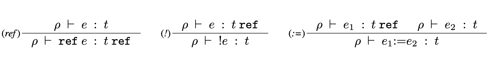
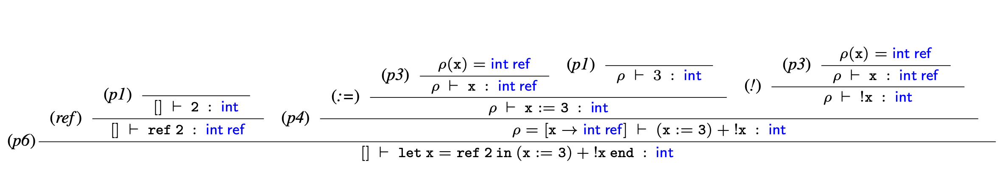
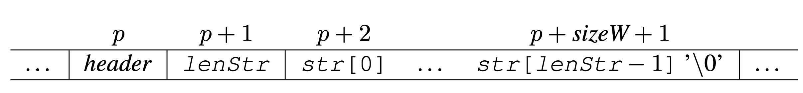
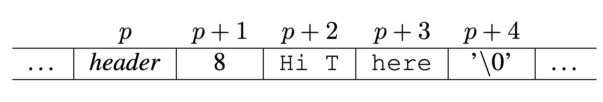

## Opgave 1 (25 %): Regulære udtryk og automater
...drawing stuff...

---
## Opgave 2 (25 %): Referencer i Funktionssprog
### Opgave Beskrivelse:
"_Opgaven er at udvide funktionssproget med referencer, således at de kan evalueres. I den abstrakte syntaks
repræsenteres en reference med `Ref e`, hvor e er et vilkårligt udtryk. Et udtryk `e` derefereres med `Deref e` og et
referenceudtryk `e1` opdateres med værdien af `e2` ved `UpdRef(e1,e2)`._"

### Question 1:
#### Spørgsmål:
"_Udvid typen expr i `Absyn.fs` med `Ref`, `Deref` og `UpdRef`, således at_"
 - "_referencer kan skabes, for eksempel `Ref(CstI 1)`._"
 - "_referencer kan derefereres, for eksempel `Deref(Ref(CstI 1))`._"
 - "_referencer kan opdateres, for eksempel `UpdRef(Ref(CstI 1), CstI 2)`._"

#### Svar:
```fsharp
type expr = 
  ...
  | Ref of expr
  | Deref of expr
  | UpdRef of expr * expr
```

### Question 2:
#### Spørgsmål:
"_Udvid typen value i `HigherFun.fs` med følgende konstruktion således at referenceværdier kan håndteres:_"

```fsharp
RefVal of value ref
```

#### Svar:
```fsharp
type value = 
  ...
  | RefVal of value ref (* The 'ref' is an F# primitive type - it works like a mutable type*)
```

### Question 3:
#### Spørgsmål:
"_Udvid funktionen eval i `HigherFun.fs`, med evaluering af `Ref`, `Deref` og `UpdRef`, således at de opfylder følgende:_"

...

**Hint!**: Du skal anvende F#’s support af referencer, dvs. `ref`, `!` og `:=`. Bemærk at vores implementation af
`UpdRef` er anderledes end `:=` i F#, hvor værdien unit returneres. 

"_Test at din implementation virker ved at bruge de følgende eksempler:_"
```fsharp
// 
let exam1 = Let("x",Ref(CstI 1), If (Prim("=",Deref(Var "x"), CstI 1), UpdRef(Var "x", CstI 2), CstI 42))
// Result should be Int 2
```

```fsharp
let exam2 = Let ("x",Ref (CstI 2), Prim ("+",UpdRef (Var "x",CstI 3), Deref (Var "x")))
// Result should be Int 6
```

#### Svar:
Changes to file `HigherFun.fs`:
```fsharp
let rec eval (e : expr) (env : value env) : value =
    match e with
    ...
    | Ref (e) -> RefVal (ref (eval e env))
    | Deref (r) ->      
      match (eval r env) with
      | RefVal ref -> ref.Value 
      | _ -> failwith "Value was not a reference"
    | UpdRef (r, ue) ->
      let ref    = eval r env
      let newVal = eval ue env
      
      match ref with
      | RefVal ref ->
        ref.Value <- newVal
        RefVal ref
      | _ -> failwith "Value was not a reference"
```

Running the provided examples:
```fsharp
> run exam1;;
val it: HigherFun.value = Int 2

> run exam2;;
val it: HigherFun.value = Int 6
```

### Question 4:
#### Spørgsmål:

#### Svar:


### Question 5:
#### Spørgsmål:
"_Udvid lexer og parser, således at referencer er understøttet med samme syntaks, som vi kender fra F#. Det skal for eksempel være muligt at skrive `ref 1`, `!(ref 1)` og `(ref 1) := 2` svarende til eksemplerne ovenfor (pind 1). Vis (i udklip) de modifikationer du har lavet til `FunLex.fsl` og `FunPar.fsy` og giv en skriftlig forklaring af modifikationerne på 5–10 linjer._"

#### Svar:
Changes to `FunLex.fsl`:


Changes to `FunPar.fsy`:
```fsharp
%right UPDREF           /* lowest precedence  */
...
%left DEREF
%nonassoc NOT           /* highest precedence  */
```

We have to assign both an associativity and precedence to our `UPDREF` (`:=`) and `DEREF` (`!`) tokens. 
 - `DEREF`:
   - This token is given among the highest precedence because we want to retrieve the value stored inside the `ref` before performing further operations on the `Expr`
 - `UPDREF`:
   - This token is given a low precedence and an associativity of `%right` as we want the RHS expression to be evaluated first before the `ref` has it's value updated. 

### Question 6:


### Question 7:
### Spørgsmål:
"_Til at beskrive typen af referenceudtryk introducerer vi en ny type t ref. Eksempelvis vil ref 1 have typen
int ref, præcis som i F#. Dette kan beskrives med følgende tre typeregler, hvor operatorerne ! og :=
beskrives af de to sidste:_"



"Angiv et typeinferenstræ for udtrykket `let x = ref 2 in (x := 3) + !x end`."

### Svar:


---
## Opgave 3 (25 %): Strenge i List-C
### Opgave Beskrivelse:
"_I denne opgave udvider vi sproget List-C med strenge allokeret på hoben (eng. heap). Som beskrevet nederst side 127 i PLC er der allerede support
for at parse strenge i `CLex.fsl` og `CPar.fsy` søg efter `CSTSTRING` i de to filer._"

"_I C, som `listmachine.c` er skrevet i, er strenge altid nul-termineret, dvs. slutter
med `’\0’`. Et tegn fylder 8 bit og et 32 bit ord har plads til 4 tegn. En streng str er dermed repræsenteret med en
header, efterfulgt af længden af strengen (`lenStr`), efterfulgt af strengens lenStr tegn og afsluttet med `’\0’`. Som
eksempel er strengen `"Hi There"` repræsenteret nedenfor. I eksemplet har vi i alt brug for 9 tegn (de 8 plus `’\0’`), hvilket fylder 3 ord, dvs. `sizeW = 3`._"





"_Opgaven er at udvide List-C således at konstante strenge kan oprettes. Vi genbruger typen dynamic for strenge, se eksempel nedenfor._"

```fsharp
void main() {
   dynamic s1;
   dynamic s2;
   s1 = "Hi there";
   s2 = "Hi there again";
}
```

### Opskrift:
"_Nedenfor følger en opskrift på at udvide List-C med strenge._"

- `Absyn.fs`:
  - "_Tilføj `CstS` til typen expr som repræsenterer den konstante streng i den abstrakte syntaks._"
  - `CPar.fsy`:
    - "_Tilføj en regel med CSTSTRING således at en knude i den abstrakte syntaks med CstS oprettes for den konstante streng, fx_"

  ```fsharp
   AtExprNotAccess:
      Const              { CstI $1 }
    | CSTSTRING          { CstS $1 }
    ...
  ```
- `Machine.fs`:
  - "_Tilføj en instruktion `CSTS` of string, som repræsenterer den konstante streng. Ideen er at lægge strengen som del af programkoden med følgende layout_"
  - "_Hvert tegn i strengen fylder et ord i programkoden. I funktionen makelabenv skal antallet af ord som instruktionen fylder angives. Af ovenstående ses at det er `strLen+2`. I funktionen emitints skal koden genereres. Hjælpefunktionen explode omdanner hvert tegn i strengen til en integer:_" `let explode s = [for c in s -> int c]`
  - "_Programkoden for CSTS kan derefter genereres således:_"

  ```fsharp
   ...
   | CSTS s -> CODECSTS :: (String.length s) :: ((explode s) @ ints)
   ...
  ```

 - `Comp.fs`:
   - "_I funktionen `cExpr` oversættes `CstS` nemt til instruktionen oprettet i `Machine.fs`: `| CstS s -> [CSTS s]`_"

   - `listmachine.c`:
     - "_Vi lader en streng få tagget 1: `#define STRINGTAG 1`. Vi lader `CSTS` repræsentere instruktionen genereret ovenfor. Dette giver følgende case i funktionen `execcode`. **Bemærk**! Vi udskriver strengen på skærmen som debug, således at vi kan se at strengen er oprettet._"

     ```c++
        case CSTS: {
            int lenStr = p[pc++];
            int sizeStr = lenStr + 1; // Extra for zero terminating string, \0.
            int sizeW = (sizeStr % 4 == 0)?sizeStr/4:(sizeStr/4)+1; // 4 chars per word
            sizeW = sizeW + 1; // Extra for string length.
            word* strPtr = allocate(STRINGTAG, sizeW, s, sp);
            s[++sp] = (int)strPtr;
            strPtr[1] = lenStr;
            char* toPtr = (char*)(strPtr+2);
            for (int i=0; i<lenStr; i++)
                toPtr[i] = (char) p[pc++];
            toPtr[lenStr] = ’\0’; // Zero terminate string!
            printf ("The string \"%s\" has now been allocated.\n", toPtr); /* Debug */
        } break;
     ```
### Question 1:
#### Spørgsmål:
"_Vis (i udklip) de modifikationer du har lavet til filerne `Absyn.fs`, `CPar.fsy`, `Comp.fs`, `Machine.fs`
og `listmachine.c` for at få ovenstående opskrift til at virke. Giv en skriftlig forklaring af modifikationerne på 5–15 linjer_"

#### Svar:
Changes in `Absyn.fs`:
```fsharp
and expr =                                                         
  ...
  | CstS of string
  ...
```

Changes in `CPar.fsy`:
```text
AtExprNotAccess:
    Const                               { CstI $1               }
  | CSTSTRING                           { CstS $1               }
  ...
```

Changes in `Comp.fs`:
```fsharp
and cExpr (e : expr) (varEnv : varEnv) (funEnv : funEnv) : instr list = 
    match e with
    ...
    | CstS s         -> [CSTS s]
```

Changes in `Machine.fs`:
```fsharp
type instr =
  | Label of label                     (* symbolic label; pseudo-instruc. *)
  | CSTI of int                        (* constant                        *)
  | CSTS of string

let CODECSTS = 32

let explode s = [for c in s -> int c]

let makelabenv (addr, labenv) instr = 
    match instr with
    ...
    | CSTS s         -> (addr+(s.Length+2), labenv)
    
let rec emitints getlab instr ints = 
    match instr with
    ...
    | CSTS s         -> CODECSTS :: (String.length s) :: ((explode s) @ ints)

    
```

Changes to `listmachine.c` are just the provided code above.

Generated Abstract Syntax:
```text
Prog
  [Fundec
     (None, "main", [],
      Block
        [Dec (TypD, "s1"); Dec (TypD, "s2");
         Stmt (Expr (Assign (AccVar "s1", CstS "Hi there")));
         Stmt (Expr (Assign (AccVar "s2", CstS "Hi there again")))])]%
```

### Question 2:
#### Spørgsmål:
"_Vis med eksempelprogrammet ovenfor at strenge kan oprettes. Giv en skriftlig forklaring af den abstrakte syntaks, som skabes når eksempelprogrammet oversættes._"

#### Svar:
I was unable to get the program to run properly. Typical `ListC`...

---
## Opgave 4 (25 %): Interval check i micro-C
### Opgave Beskrivelse:
"_Med interval check menes et boolsk udtryk på formen `z op1 x op2 y`, hvor `x`, `y` og `z` er af typen `int`. Udtrykket `z op1 x op2 y` er sandt hvis og kun hvis `z op1 x` og `x op2 y` begge er sande. 
De to operatorer `op1` og `op2` kan være en af følgende nye boolske operatorer: `.==`, `.!=`, `.>`, `.<`, `.>=` og `.<=`. Operatoren `.==` svarer til den
eksisterende oprator `==` i micro-C og således også for de andre. Operatorerne til interval check har fået tilføjet et punktum for at simplificere parseren. Se det nedenstående eksempel_"

```c++
void main() {
    print 2 .< 3 .< 4;                          // 2 < 3 && 3 < 4
    print 3 .< 2 .== 2;                         // 3 < 2 && 2 == 2
    print 3 .> 2 .== 2;                         // 3 > 2 && 2 == 2
    print (3 .> 2 .== 2) == (3 .> 1 .== 1);     // (3 > 2 && 2 == 2) == (3 > 1 && 1 == 1)
    print (3 .> 2 .== 2) == 1;                  // (3 > 2 && 2 == 2) == 1
}

// Output: 1 0 1 1 1
```

"_Som eksempel kan den abstrakte syntaks for `2 .< 3 .< 4` se således ud:_"

```fsharp
Andalso (Prim2 ("<",CstI 2,CstI 3),Prim2 ("<",CstI 3,CstI 4)))))
```

### Question 1:
#### Spørgsmål:
"_Udvid micro-C med interval check, således at ovenstående eksempel giver samme resultat. Vis (i udklip) de modifikationer du har lavet til `CLex.fsl` og `CPar.fsy`. Giv en skriftlig forklaring af modifikationerne på 5 – 10 linjer._"

**Hint**: "_Det er ikke nødvendigt at ændre `Comp.fs` eller introducere nye bytekode instruktioner._"

**Hint**: "_shift/reduce konflikter i den generede parser accepteres sålænge at ovenstående program fungerer._"

#### Svar:
Changes in `CLex.fsl`:
```text
rule Token = parse
  ...
  | ".=="           { DOTEQ } 
  | ".!="           { DOTNE }
  | ".>"            { DOTGT }
  | ".<"            { DOTLT }
  | ".>="           { DOTGE }
  | ".<="           { DOTLE }
  ...
```

Changes in `CPar.fsy`:
```text
%token DOTEQ DOTNE DOTGT DOTLT DOTGE DOTLE

...

%right ASSIGN             /* lowest precedence */
...
%left EQ NE DOTEQ DOTNE 
%left GT LT GE LE DOTGT DOTLT DOTGE DOTLE
...
%nonassoc LBRACK          /* highest precedence  */

...

ExprNotAccess:
  ...
  | Expr DotOper Expr DotOper Expr      { Andalso(Prim2($2, $1, $3), Prim2($4, $3, $5)) }
;

DotOper:
    DOTEQ   { "=="  }
  | DOTNE   { "!="  }
  | DOTGT   { ">"   }   
  | DOTLT   { "<"   }
  | DOTGE   { "<="  }
  | DOTLE   { ">="  }
```

**NOTE!** This opgave perfectly illustrates how you are able to combine Abstract Syntax together in the parser file `CPar.fsy` to create the desired output.

Executing the provided example `exam01.c`:
```fsharp
> compileToFile (fromFile "./exam01.c") "./exam01.out";;
val it: Machine.instr list =
  [LDARGS; CALL (0, "L1"); STOP; Label "L1"; CSTI 2; CSTI 3; LT; IFZERO "L3";
   CSTI 3; CSTI 4; LT; GOTO "L2"; Label "L3"; CSTI 0; Label "L2"; PRINTI;
   INCSP -1; CSTI 3; CSTI 2; LT; IFZERO "L5"; CSTI 2; CSTI 2; EQ; GOTO "L4";
   Label "L5"; CSTI 0; Label "L4"; PRINTI; INCSP -1; CSTI 3; CSTI 2; SWAP; LT;
   IFZERO "L7"; CSTI 2; CSTI 2; EQ; GOTO "L6"; Label "L7"; CSTI 0; Label "L6";
   PRINTI; INCSP -1; CSTI 3; CSTI 2; SWAP; LT; IFZERO "L9"; CSTI 2; CSTI 2; EQ;
   GOTO "L8"; Label "L9"; CSTI 0; Label "L8"; CSTI 3; CSTI 1; SWAP; LT;
   IFZERO "L11"; CSTI 1; CSTI 1; EQ; GOTO "L10"; Label "L11"; CSTI 0;
   Label "L10"; EQ; PRINTI; INCSP -1; CSTI 3; CSTI 2; SWAP; LT; IFZERO "L13";
   CSTI 2; CSTI 2; EQ; GOTO "L12"; Label "L13"; CSTI 0; Label "L12"; CSTI 1;
   EQ; PRINTI; INCSP -1; INCSP 0; RET -1]

./Machine exam01.out
1 0 1 1 1 
```

### Question 2:
#### Spørgsmål:
"Udvid programmet ovenfor med mindst 5 yderligere interval check, der tester korrektheden af din løsning
til foregående delspørgsmål. Forklar på 5 – 10 linjer, i hvilken grad resultaterne er som forventet."

#### Svar:
```c++
print (1 .<= (2 == 2) .<= 2);   // 1 <= (2 == 2) && (2 == 2) <= 2
print (1==1 .== 1 .< 3);        // 1 == (1==1 && 1<3)
print (1.== (3<4) .< 2);        // 1==(3<4) && (3<4)<2
//print (1.== 3<4 .< 2);        // Fails to parse
print (3 .<= 4 .>= 2);          // 3 <= 4 && 4 >= 2
print (32 .!= 33 .< 45);        // 32 != 33 && 33 < 45
```