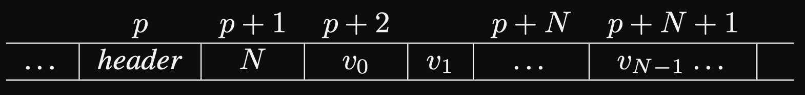
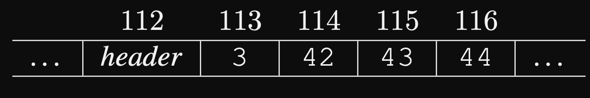
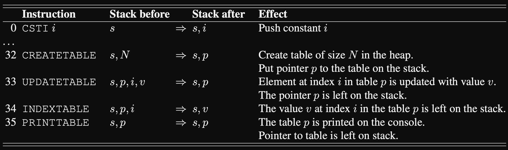

## Opgave 1 (25%): MicroC: Betinget udtryk som L–værdi
### Opgave Beskrivelse:
"_I denne opgave udvider vi oversætteren `Comp.fs` til at håndtere betingede udtryk som **L–værdier**. Betingede udtryk som **R–værdier** kender vi fra C og C# som `e1 ? e2 : e3`. Eksempelvis vil det betingede udtryk `2 < 3 ? 4 : 5` returnere værdien `4` fordi `2` er mindre end `3`. Vi definerer et betinget udtryk som **L–værdi** således `e1 ? ae2 : ae3`, hvor `e1` er et boolsk udtryk og `ae2`, `ae3` er udtryk der kan anvendes som **L–værdier**._"

```c++
void main() {
    int x; x = 1;
    int y; y = 2;
    (x < y ? x : y) = 3;
    (x < y ? x : y) = 4;
    print x; println; // Expected 3
    print y; println; // Expected 4
}
```

The key to this assignment is understanding what L-values and R-values are:
 - **L-values**:
   - Locator values - so essentially memory address.
 - **R-values**:
   - Real values - so constants like integers and characters.


### Question 1:
#### Spørgsmål:
"_Forklar betydningen af følgende konstruktioner `Block`, `Dec`, `Stmt`, `Expr`, `Assign`, `Access` og `AccVar` i nederstående abstrakte syntaks._"

```fsharp
> fromFile "exam01.c";;
val it : Absyn.program =
Prog
   [Fundec
      (None,"main",[],
      Block
         [
         Dec (TypI,"x"); Stmt (Expr (Assign (AccVar "x",CstI 1)));
         Dec (TypI,"y"); Stmt (Expr (Assign (AccVar "y",CstI 2)));
         Stmt
            (Expr
               (Assign
                  (CondExpAccess
                     (Prim2 ("<",Access (AccVar "x"),Access (AccVar "y")),
                     AccVar "x",AccVar "y"),CstI 3)));
         Stmt
            (Expr
               (Assign
                  (CondExpAccess
                     (Prim2 ("<",Access (AccVar "x"),Access (AccVar "y")),
                     AccVar "x",AccVar "y"),CstI 4)));
         Stmt (Expr (Prim1 ("printi",Access (AccVar "x"))));
         Stmt (Expr (Prim1 ("printc",CstI 10)));
         Stmt (Expr (Prim1 ("printi",Access (AccVar "y"))));
         Stmt (Expr (Prim1 ("printc",CstI 10)))])]
```

#### Svar:

| Construction | Meaning                                                                                                                                                                    |
|--------------|----------------------------------------------------------------------------------------------------------------------------------------------------------------------------|
| Block        | Represents a function closure - a list of statements or declarations. In the abstract syntax (**AS**), we have a single `Block` and it represents our `main` function.     |
| Dec          | Declare a new local variable. In the **AS**, we create 2 new local variables `x` and `y` by using the constructor `Dec`.                                                   |
| Stmt         | Represents a statement. The purpose of executing a statement is to modify the state of the computation.                                                                    |
| Expr         | The purpose of evaluating an expression is to compute a value. In the **AS**, our expression are evaluated to `Assign`.                                                    |
| Assign       | Used to assign a value to a variable. In the **AS**, we use this constructor to assign our variables of `x` and `y` to the constants `CstI 1` and `CstI 2`, respectively.  |
| Access       | Used to retrieve the value of a specific `AccVar`.                                                                                                                         |
| AccVar       | Used to locate a variable within our `varEnv`.                                                                                                                             |


### Question 2:
#### Spørgsmål:
"Angiv hvilke dele af ovenstående abstrakte syntaks der svarer til henholdsvis `int x; x=1;` og `(x < y ? x : y) = 4;` i programmet `exam01.c`."

#### Svar:
```fsharp
int x; x=1;             :: Dec (TypI,"x"); Stmt (Expr (Assign (AccVar "x",CstI 1)));
(x < y ? x : y) = 4;    :: Stmt (Expr (Assign (CondExpAccess (Prim2 ("<",Access (AccVar "x"),Access (AccVar "y")), AccVar "x",AccVar "y"),CstI 4)));
```

### Question 3:
#### Spørgsmål:
"_Udvid lexer specifikation `CLex.fsl` og parserspecifikation `CPar.fsy` med support for betingede udtryk som **L–værdier**, således at ovenstående abstrakte syntaks er resultatet af at parse programmet `exam01.c` med `fromFile "exam01.c";;`._"

#### Svar:
Changes to `CLex.fsl`:
```fsharp
rule Token = parse
  ...
  | "?"             { QMARK }                 
  | ":"             { COLON }  
  ...
  | _               { failwith "Lexer error: illegal symbol" }
```

Changes to `CPar.fsy`:
```fsharp
Access:
  ...
  | Expr QMARK Access COLON Access { CondExpAccess($1, $3, $5) }  
;
```

**NOTE** Take note that the assigning portion of our statement is already handled for us. What am I talking about? This:

```fsharp
(x < y ? x : y) = 3;
```

The `= 4` is handled by the match-case `| Access ASSIGN Expr   { Assign($1, $3) }`

Changes to `Absyn.fs`:
```fsharp
and access =                                                       
  ...
  | CondExpAccess of expr * access * access 
```

### Question 4:
#### Spørgsmål:
"Lav et oversætterskema (_eng. compilation schemes_) for oversættelse af betingede udtryk som L–værdier, svarende til dem der findes i figur 8.7 i PLC:"
```fsharp
A[[ e1 ? ae1 : ae2 ]] =
   [[ e1 ]]
   ...
```

#### Svar:
```fsharp
A[[ e1 ? ae1 : ae2 ]] =
   E[[ e1 ]]
   IFZERO lab1
   A[[ ae1 ]] = 
                GETBP
                CSTI ae1
                ADD
   GOTO lab2
   lab1: A[[ ae2 ]] = 
                GETBP
                CSTI ae1
                ADD
   lab2: ...
```

### Question 5:
#### Spørgsmål:
"_Udvid `Comp.fs` således at betingede udtryk som **L–værdier** oversættes svarende til dit oversætterskema i foregående opgave. Der er ikke brug for at definere nye bytekode instruktioner._"

**Hint**: "_Du skal udvide funktionen `cAccess` i og med at kontruktionen `CondExpAccess(e1,ae2,ae3)` er tilføjet typen `access`._"

#### Svar:
Changes to `Comp.fs`:
```fsharp
| CondExpAccess (e, ae1, ae2) ->
     let lab1 = newLabel()
     let lab2 = newLabel()
     
     cExpr e varEnv funEnv
     @ [IFZERO lab1]
     @ cAccess ae1 varEnv funEnv
     @ [GOTO lab2]
     @ [Label lab1] @ cAccess ae2 varEnv funEnv 
     @ [Label lab2]
```

Executing our machine with `exam01.out`:
```fsharp
./Machine exam01.out
3 
4 
```

---
## Opgave 2:
### Opgave Beskrivelse:
"I denne opgave udvider vi oversætteren `Comp.fs` til at håndtere alias af variable. Betragt nedenstående eksempel `exam04.c`:"

```c++
void main(int n) {
   int i;
   i=0;
   alias j as i; // Make local variable j an alias of local variable i
   while (j < n) {
      print j;
      i=i+1;
   }
}
```

"_For at implementere alias udvider vi typen `stmtordec` i filen `Absyn.fs` med `Alias`:_"

```fsharp
and stmtordec =
   | Dec of typ * string        (* Local variable declaration *)
   | Alias of string * string   (* Exam 2021 *)
   | Stmt of stmt               (* A statement *)
```

"_Med denne udvidelse, samt udvidelse af lexer og parser, kan vi udtrykke programmet `exam04.c` med følgende abstrakte syntaks:_"

```fsharp
Prog
   [Fundec
      (None,"main",[(TypI, "n")],
         Block
            [
               Dec (TypI,"i"); Stmt (Expr (Assign (AccVar "i",CstI 0)));
               Alias ("j","i");
               Stmt
                  (While
                     (Prim2 ("<",Access (AccVar "j"),Access (AccVar "n")),
                     Block
                        [
                           Stmt (Expr (Prim1 ("printi",Access (AccVar "j"))));
                           Stmt (Expr (Assign (AccVar "i",Prim2 ("+",Access (AccVar "i"),CstI 1))))]))])]
```

### Question 1:
#### Spørgsmål:
"_Udvid lexer specifikation `CLex.fsl` og parserspecifikation `CPar.fsy` med support for alias, således at ovenstående abstrakte syntaks er resultatet af at parse programmet `exam04.c` med `fromFile "exam04.c";;`._"

#### Svar:
Changes in `CLex.fsl`:
```fsharp
let keyword s =
    match s with
    ...
    | "as"      -> AS
    | "alias"   -> ALIAS
    | _         -> NAME s
```

Changes in `CPar.fsy`:
```fsharp
%token ALIAS AS

...

StmtOrDecSeq:
    /* empty */                           { []                      }
  ...
  | ALIAS NAME AS NAME SEMI StmtOrDecSeq  { Alias($2, $4) :: $6     }                 
;
```

**But why?** The solution is the way that it is because `StmtOrDecSeq` is essentially the core for any given function. Take note in the following from `CPar.fsy`:

```fsharp
Block:
    LBRACE StmtOrDecSeq RBRACE          { Block $2 }
;
```

The `Block` constructor is the core component to any function - and therefore any program we compile. As such, we are essentially adding our new `Alias` instruction to the core part of any program. As such, we have to recursively call `StmtOrDecSeq` and append it to our `Alias` so as to keep our program going. 

### Question 2:
#### Spørgsmål:
"Med udgangspunkt i nedenstående stack frame (figur 8.2 i PLC ) for funktionen `main` i `exam04.c`, udfyld de manglende lokale variable efter at `alias j as i` er afviklet, `<fill out>`."

#### Svar:
```text
-----stack grows from left to right ----->
-----+----------+--------+-----+-----------+--------
...  | ret addr | old bp |  n  |    i/j    | temps |
-----+----------+--------+-----+-----------+--------
```

### Question 3:
#### Spørgsmål:
"Udvid `Comp.fs` med oversættelse af alias som beskrevet ovenfor. Der er ikke brug for at definere nye bytekode instruktioner."

**Hint**: "_Du skal udvide funktionen `cStmtOrDec` i og med at konstruktionen `Alias(x,y)` er tilføjet typen `stmtordec`_"

**Hint**: "_For `Alias(x,y)` er opgaven at udvide environment varEnv med en ny variabel `x`. Variablen `x`
skal arve typen og adressen fra `y`, som fås ved at slå `y` op i omgivelsen `varEnv`. Der er to tilfælde: `y` kan
være en lokal eller en global variabel._"

#### Svar:
Changes made to `Comp.fs`:
```fsharp
and cStmtOrDec stmtOrDec (varEnv : varEnv) (funEnv : funEnv) : varEnv * instr list = 
    match stmtOrDec with 
    ...
    | Alias (v1, v2) ->        
        match (lookup (fst varEnv) v2) with
        | Locvar addr, typ ->
            let newEnv = ((v1, (Locvar addr, typ)) :: fst varEnv, snd varEnv)
            (newEnv, [])
        | Glovar addr, typ ->
            let newEnv = ((v1, (Locvar addr, typ)) :: fst varEnv, snd varEnv)
            (newEnv, [])
            
    // type 'data env = (string * 'data) list
    // type varEnv = (var * typ) env * int
```

To solve this, we have to 


```fsharp
java Machine ./exam04.out 10
0 1 2 3 4 5 6 7 8 9 
```

---
## Opgave 3 (30%) List–C: Tabeller på hoben
### Opgave Beskrivelse:

"_Tabeller har et foruddefineret endeligt antal elementer. Figuren nedenfor angiver hvordan vi vil repræsentere
en tabel med `N` elementer `v0`, . . . , `vN−1` på hoben:_"


"_Som eksempel, er tabellen på størrelse 3 med elementerne `42`, `43` og `44` repræsenteret nedenfor, startende på adresse `112` i hoben._"


"_Vi udvider list–C med fire nye funktioner:_"
 - `createTable(N)` 
   - "_allokerer en tabel af størrelse N på hoben. Alle elementer initialiseres til værdien 0. Hvis N < 0 skal programmet stoppe med passende fejlmeddelelse._"
 - `updateTable(t,i,v)` 
   - "_updaterer tabellen `t` med værdien v på indeks `i`. Elementerne indekseres fra `0` til `N − 1`, hvor `N` er antallet af elementer i `t`. Programmet skal stoppe med passende fejlmeddelelse, hvis `i < 0` eller hvis `i ≥ N`._"
 - `indexTable(t,i)` 
   - returnerer værdien i indeks `i` for tabel `t`. Programmet skal stoppe med passende fejlmeddelelse, hvis `i < 0` eller hvis `i ≥ N`.
 - `printTable(t)` 
   - udskriver tabellen `t` på skærmen.



### Question 1:
#### Spørgsmål:
...
#### Svar:
...
---
## Opgave 4:
### Opgave Beskrivelse:
"_Opgaven er at udvide funktionssproget med doubles, således at vi kan evaluere udtryk med kommatal, se
eksempel `exam01` nedenfor:_"

```fsharp
let exam01 = Letfun("f1", "x", Prim("+", Var "x", CstD 1.0), Call(Var "f1", CstD 12.0));
```

### Question 1:
#### Spørgsmål:
"_Udvid typen expr i `Absyn.fs` med en konstruktør `CstD`, der repræsenterer konstante kommatal. Vis at
eksempel `exam01` accepteres._"

#### Svar:
```fsharp
type expr = 
  ...
  | CstD of double
  ...
```

#### Additional:
```fsharp
rule Token = parse
  ...
  | ['0'-'9']+ '.' ['0'-'9']+ { CSTDOUBLE (System.Double.Parse (lexemeAsString lexbuf)) }
  ...
```

```fsharp
%token <double> CSTDOUBLE

...

Const:
  ...
  | CSTDOUBLE                           { CstD($1)               }
;
```

### Question 2:
#### Spørgsmål:
"_Udvid typen `value` og funktionen `eval` i `HigherFun.fs`, således at udtryk med kommatal kan evalueres. De primitive operatorer `∗,` `+,` `−`, `=`, `<` defineres, således at de enten fungerer for to heltal eller to
kommatal. Funktionen eval skal fejle, hvis man forsøger at anvende en operator på et heltal og kommatal
samtidigt. Vi resultatet af at køre `exam01` ovenfor og eksempel `exam02Err` nedenfor:_"

```fsharp
let exam02Err = Prim("+", CstD 23.0, CstI 1)
```

#### Svar:
Changes made to `HigherFun.fs`:
```fsharp
type value = 
  ...
  | Double of double
  ...

let rec eval (e : expr) (env : value env) : value =
    match e with
    ...
    | CstD d -> Double d                                                    // Added conversion of abstract syntax "CstD d" to "Double d"
    ...
    | Prim(ope, e1, e2) -> 
      let v1 = eval e1 env
      let v2 = eval e2 env
      match (ope, v1, v2) with
      ...
      | ("*", Double d1, Double d2) -> Double (d1 * d2)
      | ("+", Double d1, Double d2) -> Double (d1 + d2)
      | ("-", Double d1, Double d2) -> Double (d1 - d2)
      | ("=", Double d1, Double d2) -> Double (if d1 = d2 then 1 else 0)
      | ("<", Double d1, Double d2) -> Double (if d1 < d2 then 1 else 0)
      |  _ -> failwith "unknown primitive or wrong type"
```

### Question 3:
#### Spørgsmål:
"_For at konvertere mellem heltal og kommatal definerer vi to nye primitiver:_"

 - `toInt`: 
   - Som konverterer et kommatal til heltal. Kommatallet skal trunkeres mod nul, dvs. du kan
     anvende F# (`int`) type cast.
 - `toDouble`:
   - Som konverterer et heltal til kommatal. Du kan anvende F# (`double`) type cast.

#### Svar:
Changes to file `HigherFun.fs`:
```fsharp
let rec eval (e : expr) (env : value env) : value =
    match e with
    ...
    | Prim1(ope, e) ->
      let v = eval e env
      match (ope, v) with
      | ("toInt",     Double d)  -> Int ((int) d)
      | ("toDouble",  Int i)     -> Double ((double) i)
      | ("toInt",     Int i)     -> Int i
      | ("toDouble",  Double d)  -> Double d
      | _ -> failwith "unknown primitive type or operator"
    ...
```

Running the provided example:
```fsharp
> open ParseAndRunHigher;;
> open Absyn;;
> let exam05 = Let("x",CstD 23.0, Prim("*",CstI 2,Prim1("toInt", Var "x")));;           // Provided example
val exam05: expr = Let ("x", CstD 23.0, Prim ("*", CstI 2, Prim1 ("toInt", Var "x")))
> run exam05;;
val it: HigherFun.value = Int 46
```